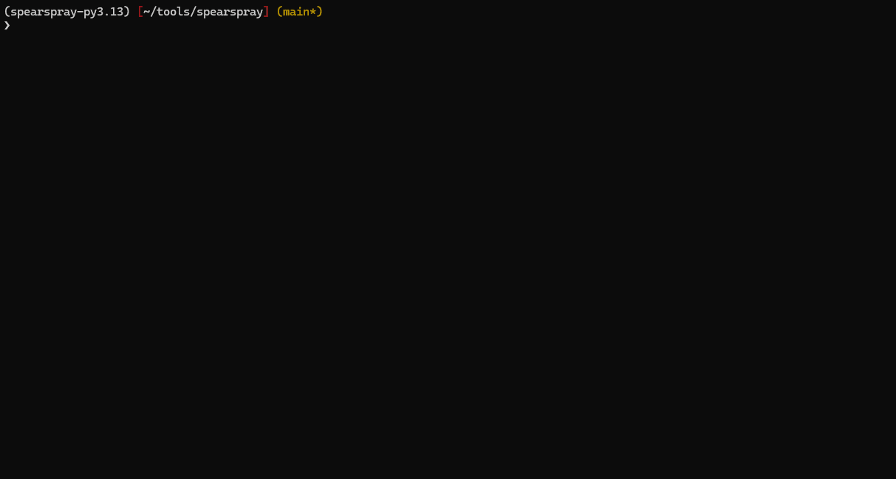

# SpearSpray

**SpearSpray** is an advanced password spraying tool designed specifically for Active Directory environments. It combines user enumeration via LDAP with intelligent pattern-based password generation to perform controlled and stealthy password spraying attacks.



## Table of Contents

- [Features](#features)
  - [Core Capabilities](#core-capabilities)
  - [Security & Stealth Features](#security--stealth-features)
  - [Advanced Pattern System](#advanced-pattern-system)
- [Requirements](#requirements)
- [Installation](#installation)
  - [Prerequisites](#prerequisites)
  - [From GitHub (Recommended)](#from-github-recommended)
  - [Using Poetry](#using-poetry)
  - [Direct Installation](#direct-installation)
- [Usage](#usage)
  - [Basic Usage](#basic-usage)
  - [Advanced Usage](#advanced-usage)
  - [Command Line Options](#command-line-options)
- [Pattern System](#pattern-system)
  - [Key Innovation: User-Specific Temporal Data](#key-innovation-user-specific-temporal-data)
  - [Available Variables](#available-variables)
  - [Default Patterns File (patterns.txt)](#default-patterns-file-patternstxt)
  - [Custom Pattern Examples](#custom-pattern-examples)
  - [Adding Custom Variables](#adding-custom-variables)
- [Why Kerberos Authentication?](#why-kerberos-authentication)
- [Security Considerations](#security-considerations)
  - [Account Lockout Protection](#account-lockout-protection)
  - [Stealth Features](#stealth-features)
  - [Best Practices](#best-practices)
- [Warning](#warning)
- [Legal Disclaimer](#legal-disclaimer)
- [Troubleshooting](#troubleshooting)
- [Acknowledgments](#acknowledgments)
- [Contributing](#contributing)
- [License](#license)
- [Author](#author)

## Features

### Core Capabilities
- **LDAP Integration**: Direct enumeration of Active Directory users through LDAP queries
- **Custom LDAP Queries**: Define specific queries to target only certain users or groups for spraying
- **Pattern-Based Password Generation**: Flexible templating system for creating targeted password lists
- **Domain Policy Awareness**: Automatic retrieval and respect of domain password policies
- **Account Lockout Protection**: Smart filtering to avoid locking out user accounts
- **PSO Detection**: Identification and handling of users with Password Settings Objects
- **Kerberos Authentication**: Fast and efficient authentication testing via Kerberos pre-authentication

### Security & Stealth Features
- **Jitter Support**: Configurable delays between authentication attempts
- **Threshold Management**: Automatic filtering of users near lockout thresholds
- **Multi-threaded**: Configurable thread count for performance optimization
- **Rate Limiting**: Control requests per second to prevent overwhelming domain controllers
- **SSL/LDAPS Support**: Secure LDAP connections when required

### Advanced Pattern System
- **Dynamic Variables**: Support for user-specific data (name, date of last password change...)
- **Custom Separators & Suffixes**: Flexible password pattern customization
- **Extra Words**: Integration of company-specific terms and seasonal patterns
- **Interactive Pattern Selection**: Dynamic menu system for pattern selection

## Requirements

- Python 3.8+
- Valid Active Directory credentials
- Network access to target domain controller

## Installation

### Prerequisites

```bash
# Install system dependencies (Ubuntu/Debian)
sudo apt-get update
sudo apt-get install python3-dev libkrb5-dev libldap2-dev libsasl2-dev

# Install system dependencies (CentOS/RHEL)
sudo yum install python3-devel krb5-devel openldap-devel libsasl2-dev

# Install system dependencies (macOS)
brew install krb5 openldap
```

### From GitHub (Recommended)

```bash
git clone https://github.com/sikumy/spearspray.git
cd spearspray
pip install -e .
```

### Using Poetry

```bash
git clone https://github.com/sikumy/spearspray.git
cd spearspray
poetry install
poetry run spearspray --help
```

### Direct Installation

```bash
pip install git+https://github.com/sikumy/spearspray.git
```

## Usage

### Basic Usage

```bash
# List available pattern variables
spearspray -l

# Basic password spraying with default settings
spearspray -u administrator -p Password123 -d contoso.local -dc dc01.contoso.local

# Use custom patterns file
spearspray -u administrator -p Password123 -d contoso.local -dc dc01.contoso.local -i custom_patterns.txt

# Add extra word for pattern generation
spearspray -u administrator -p Password123 -d contoso.local -dc dc01.contoso.local -x "Contoso"
```

### Advanced Usage

```bash
# Full featured example with SSL, rate limiting, and custom separators
spearspray -u administrator -p Password123 -d contoso.local -dc dc01.contoso.local \
  --ssl \
  --max-rps 2.0 \
  -j 1.0,2.0 \
  -t 5 \
  -x "Company" \
  -sep "@" \
  -suf "!" \
  -debug

# Custom LDAP query to target specific users
spearspray -u administrator -p Password123 -d contoso.local -dc dc01.contoso.local \
  -q "(&(objectCategory=person)(objectClass=user)(!(userAccountControl:1.2.840.113556.1.4.803:=2))(department=IT))"

# Conservative approach for stealth
spearspray -u administrator -p Password123 -d contoso.local -dc dc01.contoso.local -t 5 --max-rps 3 -j 2.0,5.0 --ssl
```

### Command Line Options

#### LDAP Configuration
- `-d, --domain`: LDAP domain name (e.g., contoso.local) **[Required]**
- `-u, --username`: LDAP username **[Required]**
- `-p, --password`: LDAP password **[Required]**
- `-dc, --domain-controller`: FQDN or IP of domain controller **[Required]**
- `-q, --query`: Custom LDAP query (default: enabled users excluding msol/adsync accounts)
- `--ssl`: Use SSL/LDAPS connection (port 636)
- `-lps, --ldap-page-size`: LDAP paging size (default: 200)

#### Password Spraying Configuration
- `-t, --threads`: Number of concurrent threads (default: 10)
- `-j, --jitter`: Delay between attempts: N seconds or N,M range (default: 0)
- `--max-rps`: Maximum Kerberos requests per second
- `-thr, --threshold`: Password attempts buffer before lockout (default: 2)

#### Pattern Configuration
- `-i, --input`: Patterns file path (default: patterns.txt)
- `-x, --extra`: Extra word for patterns (no spaces/commas)
- `-sep, --separator`: Separator characters for patterns
- `-suf, --suffix`: Suffix characters for patterns

#### Other Options
- `-s, --silent`: Don't display startup banner
- `-debug`: Enable debug logging with file output
- `-l, --list`: List available pattern variables and exit


## Pattern System

SpearSpray uses an advanced pattern system to generate **highly targeted and personalized passwords for each user**. Unlike generic wordlists, every password attempt is customized based on the user's specific information retrieved from Active Directory.

### Key Innovation: User-Specific Temporal Data

**All temporal variables (years, months, seasons) are calculated based on each user's individual password change date (`pwdLastSet` attribute), not the current date.** This means that if a user changed their password in March 2024, the patterns will generate passwords using March 2024 data, significantly increasing the likelihood of success.

### Available Variables

| Variable | Description | Example |
|----------|-------------|---------|
| `{name}` | User's first name (from displayName) | Eren |
| `{samaccountname}` | User's SAM account name | eren.yeager |
| `{year}` | Year from pwdLastSet (or whenCreated) | 2024 |
| `{short_year}` | Last two digits of year | 24 |
| `{month_number}` | Month number (zero-padded) | 03 |
| `{month_en}` | Month name in English | March |
| `{month_es}` | Month name in Spanish | Marzo |
| `{season_en}` | Season in English | Spring |
| `{season_es}` | Season in Spanish | Primavera |
| `{extra}` | Extra word provided via `-x` argument | CompanyName |
| `{separator}` | Custom separator via `-sep` argument | @ |
| `{suffix}` | Custom suffix via `-suf` argument | ! |

### Default Patterns File (patterns.txt)

```plaintext
# User (samaccountname) as pass
{samaccountname}

# User first name + Year
{name}{separator}{year}{suffix}
# User first name + Year in short format
{name}{separator}{short_year}{suffix}
# User first name + Month number + Year in short format
{name}{separator}{month_number}{short_year}{suffix}

# Month name + Year
{month_en}{separator}{year}{suffix}
# Month name + Year in short format
{month_en}{separator}{short_year}{suffix}

# Season name + Year
{season_en}{separator}{year}{suffix}
# Season name + Year in short format
{season_en}{separator}{short_year}{suffix}

# Exact password from extra argument (e.g., -x 'Company123$!')
{extra}
# Extra argument + Year
{extra}{separator}{year}{suffix}
# Extra argument + Year in short format
{extra}{separator}{short_year}{suffix}
```

### Custom Pattern Examples

**Example scenario**: User "Eren" changed his password on March 15, 2024. Using the extra word "Paradis", separator "@", and suffix "!", the patterns would generate:

- `{extra}{suffix}` → `Paradis!`
- `{name}{separator}{year}{suffix}` → `Eren@2024!` *(based on his March 2024 password change)*
- `{month_en}{separator}{short_year}{suffix}` → `March@24!` *(March 2024 when he changed password)*
- `{season_en}{separator}{year}{suffix}` → `Spring@2024!` *(Spring 2024 season of password change)*

**Why this matters**: Now consider if Eren's colleague "Mikasa" changed her password in November 2023. Her patterns would generate completely different temporal values based on her specific password change date:
- `{name}{separator}{year}{suffix}` → `Mikasa@2023!`
- `{month_en}{separator}{short_year}{suffix}` → `November@23!`
- `{season_en}{separator}{year}{suffix}` → `Autumn@2023!`

This user-specific approach dramatically increases password spraying effectiveness compared to generic wordlists.

### Adding Custom Variables

SpearSpray allows you to extend the pattern system by adding custom variables. To add a new variable:

1. **Register the variable** in `spearspray/utils/variables_utils.py`:
```python
def register_variables(variables: "VariablesManager") -> None:
    # ...existing variables...
    variables.register("custom_var", "Description of your custom variable", "")
```

2. **Implement the variable logic** in the `variable_resolver` function:
```python
def variable_resolver(user: dict, selected_pattern: str, variables: list, extra: str, separator: str, suffix: str) -> str:
    # ...existing code...
    
    for var in variables:
        # ...existing variable handlers...
        
        elif var.name == "custom_var":
            # Your custom logic here
            values[var.name] = "your_custom_value"
```

**Example**: Adding a domain variable that extracts the domain from the user's email:
```python
# In register_variables function
variables.register("domain", "Domain extracted from user email", "")

# In variable_resolver function
elif var.name == "domain":
    email = user.get("mail", "")
    values[var.name] = email.split("@")[1] if "@" in email else ""
```

You can then use `{domain}` in your patterns file to include the user's email domain in password generation.

## Why Kerberos Authentication?

SpearSpray uses **Kerberos pre-authentication** instead of traditional methods to reduce detection:

Traditional methods (NTLM/SMB/LDAP) generate highly monitored events like **4625** (failed logons).  
Kerberos pre-auth generates **Event 4768** (TGT requested - valid credentials) and **4771** (pre-authentication failed - invalid attempts), which are less monitored by most SOCs.

**Performance advantage**: Uses **gssapi** library instead of impacket for Kerberos operations. Native C bindings provide significantly faster authentication compared to Python-only implementations.

**Speed considerations**: Due to the high performance of gssapi, SpearSpray can execute authentication attempts very rapidly. **It is strongly recommended to use rate limiting options** such as:
- `--max-rps` to limit requests per second
- `-j, --jitter` to add delays between attempts
- `-t, --threads` to control concurrency

This helps prevent overwhelming the domain controller and reduces detection risk.

**Benefits**: Less noise, blends with normal AD traffic, faster execution, lower detection risk.

## Security Considerations

### Account Lockout Protection
SpearSpray automatically:
- Retrieves domain password policy via LDAP
- Filters users based on current `badPwdCount`
- Respects the threshold margin to prevent lockouts
- Identifies users with Password Settings Objects (PSO)

### Stealth Features
- **Jitter**: Add random delays between authentication attempts
- **Threading**: Control concurrency to avoid detection
- **Rate Limiting**: Use `--max-rps` to control requests per second and avoid detection
- **LDAPS**: Use encrypted LDAP connections when possible
- **Query Filtering**: Exclude service accounts and sync accounts

### Best Practices
1. **Always test in authorized environments only**
2. **Start with conservative thread counts and jitter values**
3. **Monitor domain controllers for detection**
4. **Respect organizational security policies**
5. **Use appropriate threshold margins to prevent lockouts**

## Warning

**Account Lockout Risk**: While SpearSpray implements multiple safeguards to minimize the risk of account lockouts (including domain policy retrieval, PSO detection, and badPwdCount filtering), **there is always an inherent risk when performing password spraying attacks**. Please proceed with extreme caution and always:

- Test in authorized environments only
- Start with very conservative settings (low thread counts, high jitter values)
- Monitor domain controllers for unexpected behavior
- Have a rollback plan in case of issues

**Development Notice**: This is my first security tool and while I'm continuously learning programming, I acknowledge there's still much room for improvement. Any feedback, suggestions, or contributions are greatly welcomed to help make this tool better and safer for the security community.

## Legal Disclaimer

This tool is intended for authorized penetration testing and security assessment purposes only. Users are responsible for ensuring they have explicit permission to test target systems. Unauthorized access to computer systems is illegal and may result in criminal prosecution.

## Troubleshooting

### Common Issues

1. **LDAP Connection Failed**
   - Verify domain controller IP and credentials
   - Check network connectivity
   - Try with/without SSL flag

2. **No Users Found**
   - Verify LDAP query syntax
   - Check user permissions for LDAP enumeration
   - Ensure target domain has active users

3. **Kerberos Authentication Errors**
   - Verify domain name format
   - Check time synchronization with domain controller
   - Ensure Kerberos ports (88) are accessible

## Acknowledgments

SpearSpray was inspired by and learned from several excellent security tools and their creators:

- **[kerbrute](https://github.com/TarlogicSecurity/kerbrute)** by [zer1t0](https://github.com/Zer1t0) (from [TarlogicSecurity](https://github.com/TarlogicSecurity)) - For demonstrating the importance of using Kerberos in password spraying to avoid generating common security events.
- **[sprayhound](https://github.com/Hackndo/sprayhound)** by [Hackndo](https://github.com/hackndo) (from [login-securite](https://github.com/login-securite)) - For being cautious and performing spraying only against users who won't be locked out.
- **[conpass](https://github.com/login-securite/conpass)** by [Hackndo](https://github.com/hackndo) (from [login-securite](https://github.com/login-securite)) - For their logic in checking the existence of PSO (Password Settings Objects) in users.

These tools have been invaluable sources of learning and inspiration. Special thanks to their authors for sharing their knowledge with the security community.

## Contributing

Contributions are welcome! Please feel free to submit pull requests, report bugs, or suggest enhancements.

## License

This project is licensed under the GNU General Public License v3.0 - see the [LICENSE](LICENSE) file for details.

## Author

**sikumy**

---

*SpearSpray - Enhance Your Active Directory Password Spraying with User Intelligence*